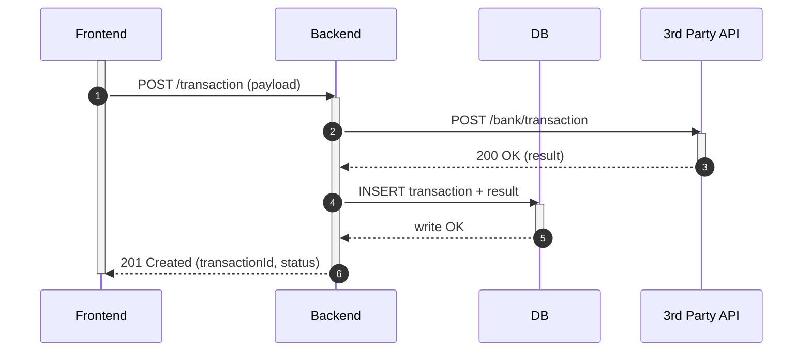
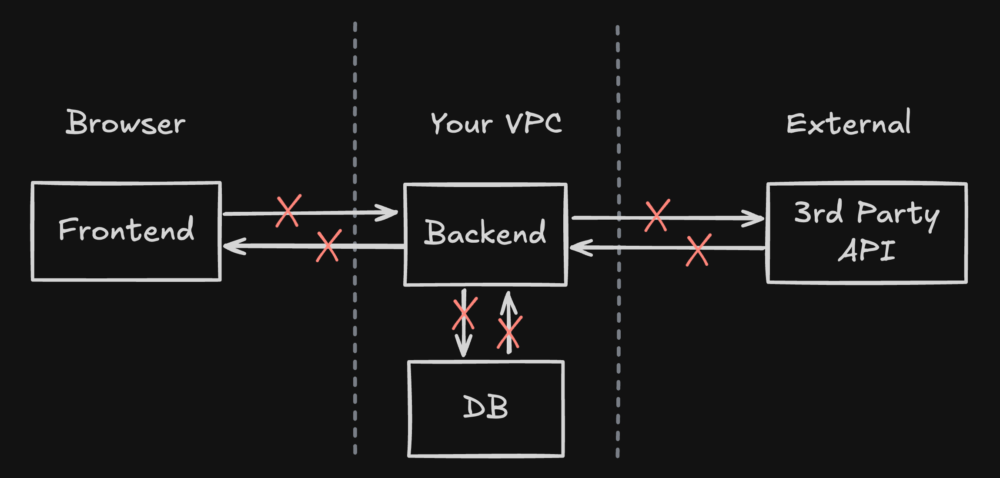
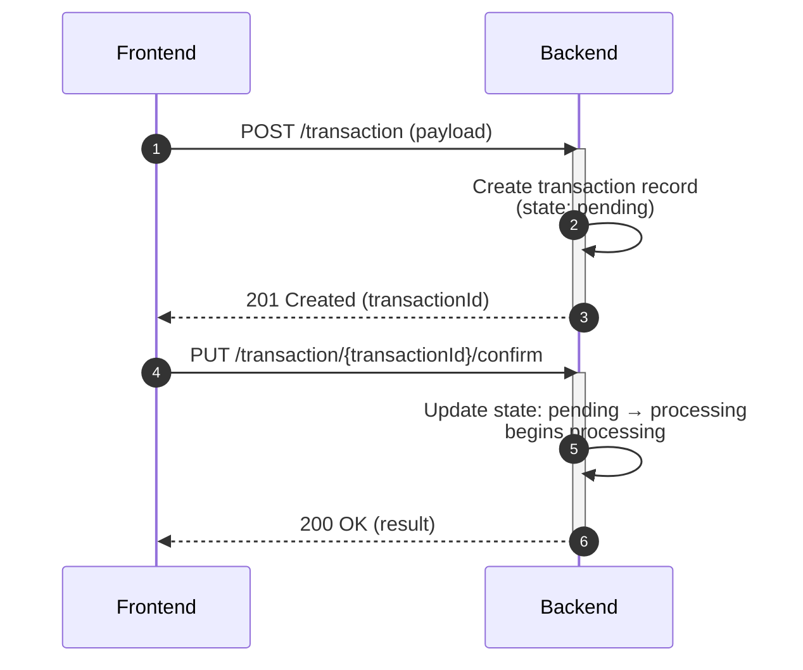
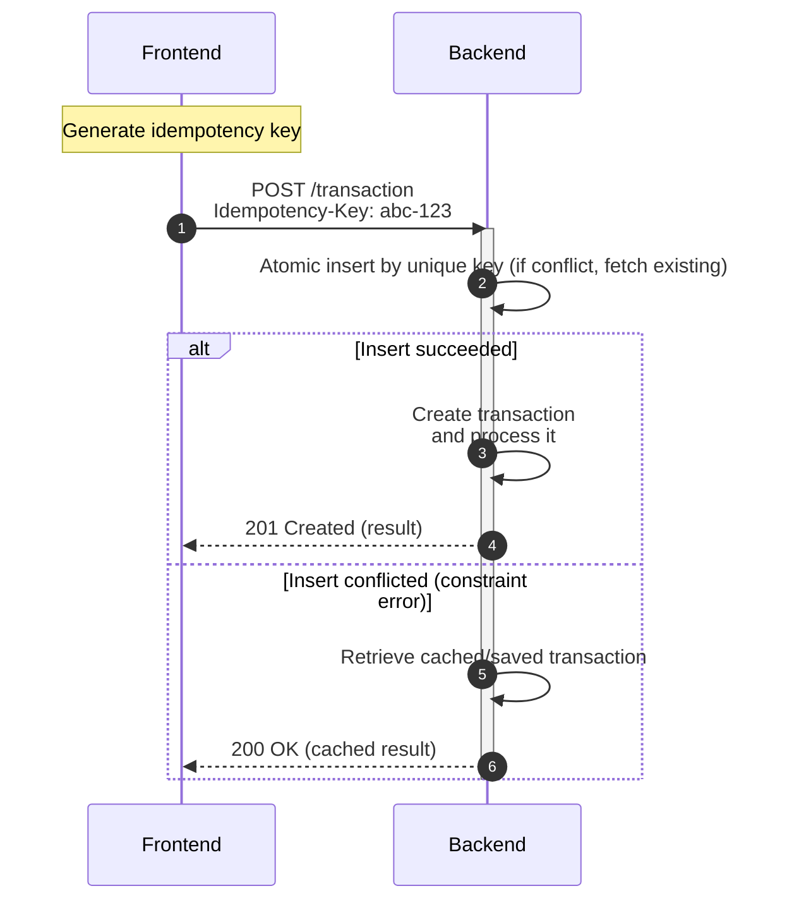
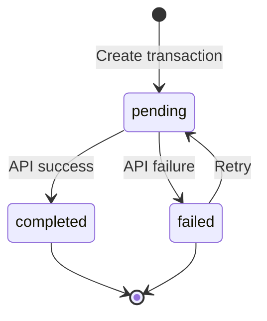
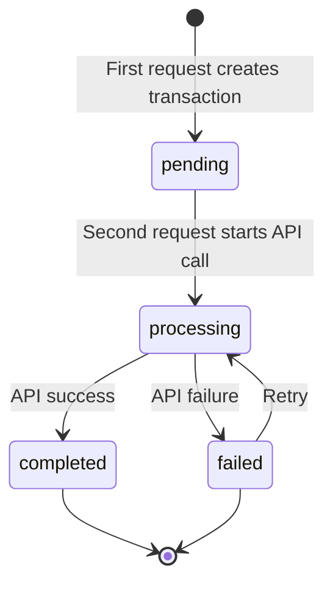
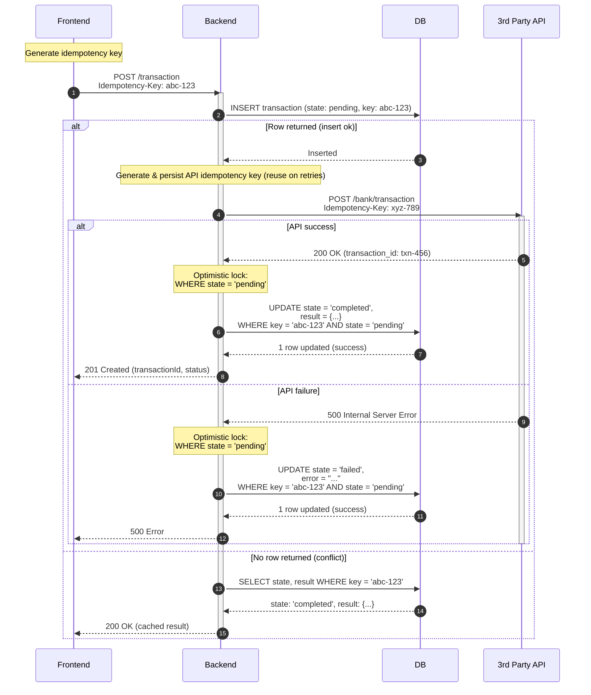
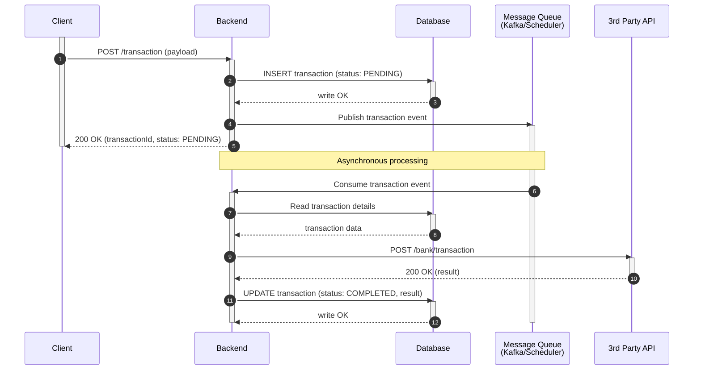

  ---
title: "These 3 Patterns Will Make Your 3rd-Party API Calls More Reliable"
slug: "reliable-api-calls"
date: 2025-11-02T00:21:02-03:00
draft: false
toc: true
images: ["/posts/reliable-api-calls/naive-api-poster.png"]
tags:
  - api-design
  - reliability
  - resilience
  - idempotency
  - state-machines
  - retries
  - optimistic-locking
  - system-design
---

I will teach you **3 patterns that will immediately improve the reliability of your API calls**.

Everyone seems to think only about the happy path when integrating with third-party APIs. But what about failures? Unreliable network conditions, timeouts, server overload, third-party APIs may not be reliable and are out of your control. These are all real problems that can cost you money, data integrity, and user trust.

## TL;DR

**If you remember one thing from this post:**

1. **Make your APIs idempotent** Use idempotency keys to prevent duplicate processing
2. **Use state machines** Track transaction lifecycle with clear states and transitions
3. **Optimistic locks are your friend** Use conditional state updates to prevent race conditions

**The three-step process:**

1. **DB transaction: Save initial state** Create transaction record with all related tables in a single database transaction
2. **API call** Make the external API call (only after initial state is persisted)
3. **DB transaction: Save result** Update transaction state and all related tables in a single database transaction

**Always have a recovery mechanism in mind** Implement a scheduler/job that periodically retries stuck transactions and moves them to final states.

---

## Naive Approach

Let's start with this seemingly innocent diagram. Can you spot what's wrong with it?

<video autoplay muted loop playsinline width="100%" poster="naive-api-poster.png" aria-label="Naive third-party API call flow animation">
  <source src="naive-api.webm" type="video/webm" />
  <source src="naive-api.mp4" type="video/mp4" />
  
</video>


The request goes from the frontend to the backend, then to the bank API, then to the database, and finally back to the frontend. Nothing can go wrong here... right?

## What Can Go Wrong?

Let me walk you through the **points of failure** in this flow:



**Every API request and response is a potential point of failure** from requests to your own backend, to third-party APIs, and even to your database. Each network hop, each service call, and each database operation can fail in ways that leave your system in an inconsistent state.

### Network Timeouts
- **FE → BE timeout**: User's request times out, did the backend process the request?
- **BE → API timeout**: Backend calls the bank API, but the connection times out. Did the transaction go through?

### API Failures
- **5xx errors**: The bank API returns 500 Internal Server Error. Was the transaction processed? Unclear.

### Database Failures
- **Write fails after API succeeds**: The bank API processed the transaction, but our database write fails. We have no record of the transaction, but the money moved.

### Duplicate Requests
- **User double-click**: User clicks "Send" twice, both requests go through.
- **Network retry**: Frontend retries the request automatically after a timeout

### Partial Completion
- **API succeeds, DB fails**: Money transferred, but no record saved
### Race Conditions
- **Concurrent identical requests**: Two requests with the same payload arrive at the same time, both get processed

### Crash Scenarios
- **Backend dies after API call**: Bank processed the transaction, backend crashed before saving to DB. On restart, we have no record.

The scary part? **All of these failures can lead to duplicate transactions or lost data**. Without proper handling, a user might get charged twice, or a transaction might disappear into the void.

## The Retry Problem

The network is unreliable. Packets drop, connections reset, servers get overloaded. When these failures happen:

- Servers return **5xx** errors.
- Timeouts occur at connection, read, or write levels
- Clients may **retry** requests

## Understanding Idempotency

According to REST principles, an **idempotent** operation is one that can be called multiple times with the same result. In other words, calling it once or calling it 10 times should produce the same outcome.

**HTTP methods and idempotency:**
- **GET, PUT, DELETE, HEAD, OPTIONS**: Idempotent by design
- **PATCH**: Not guaranteed idempotent (depends on semantics)
- **POST**: Not idempotent by default; can be made idempotent via server design (e.g., upsert-by-key) or idempotency keys

**Why POST is tricky**: By default POST creates new resources, so repeated POSTs can create duplicates. This is unacceptable for financial operations.

**What we need**: Make POSTs safe using **idempotency keys** (plus server-side upsert semantics where appropriate) so multiple calls with the same key return the same result.

## Pattern 1: Idempotency Keys

The solution is simple: attach a unique identifier to each request. If the server has seen this identifier before, it returns the cached result instead of processing again.

### Two Approaches: Server-Created vs Client-Created

There are two main approaches to handling idempotency:

#### Server-Created Idempotency Keys

With this approach, the client first calls the server to create a transaction record:

1. Client calls server (non-idempotent call to create transaction)
2. Server creates transaction record with ID and initial state
    - (e.g., `POST /transaction` creates a record with state `pending`)
3. Server returns transaction ID to client
4. Client confirms/executes using an **idempotent** call with the transaction ID
    - (e.g. `PUT /transaction/{transactionId}/confirm` will move it from `pending` to `processing`)



**Pros:**
- Server controls transaction lifecycle
- Can validate before committing
- Clear separation of concerns

**Cons:**
- Two-step process requires additional round-trip
- More complex client logic
- Duplicate requests will create transaction records, but those will never be processed. (may need cleanup/expiry logic)

#### Client-Created Idempotency

With this approach, the client generates the idempotency key:

1. Client generates idempotency key and sends with request
2. Server attempts an atomic insert under a unique constraint (no prior read)
   - If the insert succeeds: create the transaction and process it
   - If the insert conflicts: fetch and return the existing transaction/result



**Pros:**
- Single round-trip
- Simpler client flow
- Immediate execution

**Cons:**
- Client responsible for uniqueness
- Less server control over transaction creation

### UUID Uniqueness: Is It Good Enough?

When using client-created idempotency, you need a way to generate unique keys. **Random UUIDs (v4)** are the most common choice, though **UUIDs (v7)** are a good alternative.

**UUID v4 (Random)**:
- 128 bits of randomness
- Collision probability is astronomically low
- No inherent ordering or timestamp information

**UUID v7 (Time-Ordered)**:
- Includes a timestamp component (48 bits) plus randomness (74 bits)
- Sortable by creation time (useful for database indexing)
- Better for debugging/logging (you can see when the key was created)
- Still maintains high uniqueness with collision probability similar to v4

**Collision probability**: With v4/v7, collisions are negligible for practical scales.

Choose **v7** if you want time-ordering; otherwise **v4** is perfectly fine.

**Is it unique enough?** Yes, for virtually all use cases. The theoretical edge case where multiple clients generate identical UUIDs is so rare that it's not a practical concern.

### Alternatives to Random UUIDs

For special requirements, you might want **deterministic** idempotency keys:

**Format**: `module + client_id + request_hash`

- **Module identifier**: e.g., "payment", "transfer", "purchase"
- **Client ID**: Unique per client/user
- **Request hash**: Deterministic hash of the request payload

**Example**: `payment_user123_a3f5b2c1d4e6f7g8h9i0j1k2l3m4n5o6p7`

**Benefits:**
- Predictable and debuggable (you can see what operation it represents)
- Can detect duplicate attempts from the same client with the same payload
- Easier to trace in logs

**Trade-offs:**
- Longer keys (storage considerations)
- Requires careful design to avoid collisions (different clients with same payload would collide)
- Must ensure client_id is unique and secure

**Hybrid approach**: Use deterministic keys for client retries, random UUIDs for unique operations.

**Recommendation**: Random UUIDs are fine for most cases. Use deterministic keys when you need to detect exact duplicate requests from the same client.

### Implementation Details

- **Storage**: Idempotency key → result mapping in database/cache (indexed for fast lookup)
- **Response handling**: Return the same result for the same key
- **TTL considerations**: How long to store keys (typically 24-48 hours)

**Atomic creation (concurrency-safe) example:**

```sql
-- Unique index on (idempotency_key)
INSERT INTO transactions (idempotency_key, state, created_at)
VALUES ($1, 'pending', NOW())
ON CONFLICT (idempotency_key) DO NOTHING
RETURNING id;
-- If no row returned → SELECT existing row by idempotency_key
```

## Pattern 2: State Machines

To properly handle the transaction lifecycle, we need to track state. A state machine ensures we know exactly where each transaction is in the process.

### What to Save in the Database

Your transaction record should include:

- **id**: Primary key (opaque, should not be exposed to the client)
- **public_uid/idempotency_key**: Key from the client (if using client-created approach)
- **state**: Current state of the transaction
- **version**: For optimistic locking (we'll cover this next)
- **external_public_uid/external_idempotency_key**: Key used when calling external API (backend-created, persisted before the external call)
- **result**: Result + metadata from external API
- **error_details**: Error information if failed
- **created_at, updated_at**: Timestamps

### Database Transaction Strategy

When implementing API calls with state management, it's critical to use proper **database transaction boundaries** to ensure data consistency. The process should follow these three steps:

1. **Save initial state in database** (single database transaction): Create the transaction record with all necessary tables and initial state in a single database transaction. This ensures atomicity, if any part of the initial state creation fails, the entire operation rolls back, leaving your database in a consistent state.
   
   **Example**: If you need to create a transaction record and update a related table (e.g., deducting funds from an account), both operations must happen in the same transaction.

2. **Persist external idempotency key, then do API call**: After the initial state is saved, persist the external idempotency key on the transaction (optionally transition to `processing`), then make the external API call. This enables safe replay after crashes/timeouts.

3. **Save result + new state in database** (single database transaction): After receiving the API response (success or failure), update all related tables and the transaction state in a single database transaction. This includes updating the transaction record with the result, updating any related account balances, and modifying any other dependent records.

**Why this matters**: Without proper transaction boundaries, you risk partial updates. For example, if you update the transaction state successfully but fail to update a related account balance, your data becomes inconsistent. By wrapping all related updates in a single transaction, you ensure all-or-nothing semantics.

**Implementation pattern**:
```sql
BEGIN TRANSACTION;
  -- Step 1: Create initial state (all tables)
  INSERT INTO transactions (...) VALUES (...);
  UPDATE accounts SET ... WHERE ...;
  -- Commit only if all succeed
COMMIT;

-- Step 2: Make API call (outside transaction)
-- ... API call here ...

BEGIN TRANSACTION;
  -- Step 3: Update with result (all tables)
  UPDATE transactions SET state = 'completed', result = ... WHERE ...;
  UPDATE accounts SET ... WHERE ...;
  -- Commit only if all succeed
COMMIT;
```

This strategy ensures that your database always reflects a consistent state, even if the API call fails or the server crashes between operations.

### Two Types of Idempotency Keys

You need **two separate idempotency keys** for different purposes:

1. **Backend Transaction Key**: Tracks the transaction request on your backend (may be client-created or backend-created, depending on your approach)
2. **External API Key**: Used when calling the external API (always backend-created)

**Why both?** They serve different retry boundaries. When a client retries the same transaction request, your backend uses the transaction key to recognize it's a duplicate. However, when your backend needs to retry the external API call (due to a network error, timeout, etc.), it should use a separate key, either a new one each retry, or the external API may handle its own idempotency.

**Example**: 
- Client retries `POST /transaction` with transaction key `abc-123` → Backend recognizes duplicate using `abc-123`
- Backend calls bank API with external key `xyz-789` → If the backend needs to retry the same logical operation, reuse `xyz-789` when the provider supports idempotency keys. Rotating keys can create duplicates.

### State Transitions

The state flow depends on which idempotency approach you're using:

#### Client-Created Idempotency Key

With client-created keys, everything happens in a single request, so the state machine is simpler:



**State meanings:**
- **pending**: Record created, ready to process API call
- **completed**: API call succeeded, transaction finished
- **failed**: API call failed or error occurred

**When to transition:**
- **Create record**: Set state to `pending`
- **After API call**: Transition directly from `pending` to `completed` or `failed`
- **On retry**: Transition from `failed` back to `pending` (then retry API call)

#### Server-Created Idempotency Key

With server-created keys, you have a two-step process, so you need an intermediate `processing` state:



**State meanings:**
- **pending**: Record created in first request, waiting for confirmation/execution
- **processing**: Currently calling external API
- **completed**: API call succeeded, transaction finished
- **failed**: API call failed or error occurred

**When to transition:**
- **First request**: Create record with state `pending`, return transaction ID to client
- **Second request**: Transition from `pending` to `processing` before API call
- **After API call**: Transition to `completed` or `failed`
- **On retry**: Transition from `failed` back to `processing`

### Recovery Scheduler

Transactions can get stuck in `pending` state due to:
- Server crashes after creating a transaction but before calling the API
- Network failures that prevent API call completion
- Timeouts that leave transactions in an intermediate state

**Solution**: Implement a recovery scheduler (also called a "sweeper" or "cleanup job") that periodically:
1. Finds transactions stuck in `pending` state
2. Retries processing them (with appropriate retry limits)
3. Moves them to final states (`completed` or `failed`)

**Implementation approach:**

```sql
-- Find transactions stuck in pending
SELECT * FROM transactions 
WHERE state = 'pending' 
  AND updated_at < NOW() - INTERVAL '5 minutes'
ORDER BY created_at ASC
LIMIT 100;
```

**Key considerations:**
- **Frequency**: Run every few minutes (e.g., 1-5 minutes depending on your SLA)
- **Time threshold**: Only process transactions older than X minutes (e.g., 5 minutes) to avoid interfering with in-flight requests
- **Batch size**: Process in batches to avoid overwhelming the system
- **Idempotency**: Use the same optimistic locking mechanisms to ensure safe retries (e.g., `WHERE state = 'pending'`)
- **Retry limits**: Track `retry_attempts` and move to `failed` after max retries
- **Processing order**: Process oldest transactions first (ORDER BY created_at)

**State transitions for recovery:**
- `pending` (stuck) → process API call → `completed` or `failed` (using optimistic locking)

This ensures no transaction is left hanging indefinitely and improves overall system reliability.

## Pattern 3: Optimistic Locking

When a transaction record already exists (from a previous request or retry), concurrent requests trying to update it can cause race conditions. **Optimistic locking** ensures only one request can successfully update and process the transaction at a time.

### The Problem

Consider updating a user's account balance when processing transactions. Two **different transactions** arrive concurrently:

- **Transaction A**: Process $50 debit (transaction_id: `txn-1`)
- **Transaction B**: Process $50 debit (transaction_id: `txn-2`). This is a different transaction!

Both should be applied, so the balance should go from `$1000` → `$900` (1000 - 50 - 50).

**Without optimistic locking**, your code might do:

```sql
-- Read balance, calculate new value, then update
SELECT balance FROM accounts WHERE user_id = 123;
-- Returns: balance = $1000

-- Later, update with calculated value (no check on current balance)
UPDATE accounts 
SET balance = 950  -- calculated as 1000 - 50
WHERE user_id = 123
```

**What happens with concurrent requests:**
1. Request A (txn-1) reads balance → `$1000`, calculates new balance = `$950`
2. Request B (txn-2) reads balance → `$1000` (before A updates), calculates new balance = `$950`
3. Request A executes UPDATE → balance becomes `$950` ✓ (txn-1 processed)
4. Request B executes UPDATE → balance becomes `$950` ❌ **Wrong!** (txn-2 overwrites, should be `$900`)
5. **Expected**: Balance should be `$900` (both transactions: 1000 - 50 - 50)
6. **Actual**: Balance is `$950` → **Lost $50!** Transaction B's debit was lost.

The problem: The WHERE clause doesn't verify the balance hasn't changed since you read it. Both requests see the same initial value (`$1000`) and both updates succeed, causing the second transaction to overwrite the first instead of being applied on top. This same race condition occurs with **state transitions** (`pending` → `completed`, `failed` → `pending`) when multiple requests try to update the same record.

**Note**: Record creation is protected by a **unique constraint** on `idempotency_key` (database-level pessimistic locking). Optimistic locking is needed for **updating existing records** when multiple requests try to change the state concurrently.

### The Optimistic Locking Pattern

These solutions follow the same pattern:

1. **Optimistically attempt the update** with a conditional WHERE clause
2. **Check affected rows count**:
   - **0 rows updated** → Conflict detected, rollback/fail the transaction
   - **1 row updated** → Success, continue processing
3. The WHERE clause ensures only one request can proceed if they arrive simultaneously

This is "optimistic" because you assume success and check afterwards. If another request beat you, you detect the conflict and abort.

### Solution 1: Version Column

Add a `version` column to your table (integer, starts at 0 or 1):

```sql
-- Example: Update balance with version check
UPDATE accounts 
SET balance = ?, version = version + 1 
WHERE user_id = ? AND version = ?
```

**How it works:**
1. Read account with current version (e.g., `balance = $1000, version = 5`)
2. Calculate new balance (e.g., `$1000 - $50 = $950`)
3. Optimistically attempt update: only succeeds if version still matches
4. If version changed → WHERE clause fails → 0 rows updated → conflict detected → rollback (another request modified it)
5. If version matches → 1 row updated → success → continue

**Also works for state transitions:**
```sql
-- Example: Update transaction state
UPDATE transactions 
SET state = 'completed', result = ?, version = version + 1 
WHERE id = ? AND version = ?
```

**Use on all updates**: Apply this pattern to any update where concurrent modifications must be prevented (balance updates, state transitions, etc.)

**Pros:**
- Flexible, can update any field
- Good for complex updates

**Cons:**
- Requires version check in all update queries

### Solution 2: Conditional State Updates

Use the WHERE clause to ensure state hasn't changed:

```sql
-- Example: Update from pending to completed
UPDATE transactions 
SET state = 'completed', result = ?
WHERE idempotency_key = ? AND state = 'pending'

-- Example: Retry from failed to pending
UPDATE transactions 
SET state = 'pending'
WHERE idempotency_key = ? AND state = 'failed'

-- Example: Mark as failed
UPDATE transactions 
SET state = 'failed', error = ?
WHERE idempotency_key = ? AND state = 'pending'
```

**How it works:**
1. Optimistically attempt update: only succeeds if current state matches expected state
2. If state changed → WHERE clause fails → 0 rows updated → conflict detected → rollback
3. If state matches → 1 row updated → success → continue

**Use on all updates**: Apply conditional state checks to every state transition. The WHERE clause ensures atomic state machine transitions.

**Pros:**
- Simpler, no version column needed
- Atomic by nature
- Perfect for state machine transitions

**Cons:**
- Only works for state transitions
- Less flexible for other updates

### Which to Use?

**For state machines**: Use conditional state updates (recommended). It's simpler and perfectly suited for atomic state transitions.

**For complex updates**: Use version column when you need to update multiple fields and detect conflicts on any change.

## Complete Flow Example

Let's see all three patterns working together:



**Error recovery scenarios:**

- **Network timeout**: Client retries with same idempotency key → backend returns cached result
- **API 5xx error**: Transaction marked as `failed`, can retry later (might need manual intervention or retry job)
- **Duplicate request**: Same idempotency key arrives twice → second request returns existing result

## Best Practices

1. **Idempotency key format**: 
   - Use UUID v4 (random) or UUID v7 (time-ordered) for most cases (high uniqueness)
   - UUID v7 is better if you need sortable keys or timestamp information for debugging
   - Use deterministic keys (module + client_id + hash) when you need to detect exact duplicates

2. **Header placement**: 
   - Use `Idempotency-Key` header (standard practice, defined in some API specs)
   - Avoid putting it in the request body

3. **Storage strategy**: 
   - Index idempotency keys for fast lookup
   - Set reasonable TTL (24-48 hours typically)
   - Consider cache layer for hot lookups

4. **Error handling**: 
   - If key lookup fails (database error), return 500 and log
   - If duplicate key detected, return cached result (don't treat as error)

5. **State machine design**: 
   - Keep it simple with clear, descriptive state names
   - Make transitions explicit and atomic
   - Document valid state transitions

6. **Optimistic locking**: 
   - Use conditional state updates for state machine transitions (simpler, atomic)
   - Use version column when updating multiple fields independently

7. **Server vs Client created**: 
   - Use client-created for simple flows (single round-trip)
   - Use server-created when you need validation/preprocessing before execution

8. **Deterministic vs Random**: 
   - Random UUIDs (v4 or v7) for general use (simpler, sufficient uniqueness)
   - UUID v7 preferred if you need time-ordering or better database indexing performance
   - Deterministic keys when you need to detect exact duplicate attempts from same client

9. **Database transaction boundaries**: 
   - Always save initial state in a single database transaction (create transaction record + update all related tables atomically)
   - Make the API call only after initial state is successfully persisted
   - Save result + updated state in a single database transaction (update transaction record + all related tables atomically)
   - This ensures all-or-nothing semantics and prevents partial updates that lead to data inconsistency

10. **Retry policy and deadlines**:
   - Use exponential backoff with jitter and a maximum retry budget
   - Propagate and enforce end-to-end timeouts/deadlines across internal and external calls

11. **Replay responses**:
   - Return the same body and a stable status (200, or 201 if you always return 201)
   - Optionally add a replay-indicator header (e.g., `Idempotent-Replay: true`)

## Conclusion

By implementing these **3 patterns**, you'll dramatically improve the reliability of your API integrations:

1. **Idempotency Keys**: Prevent duplicate processing by using unique identifiers
2. **State Machines**: Track transaction lifecycle with clear states and transitions
3. **Optimistic Locking**: Prevent race conditions with atomic state updates

These patterns work together to handle the reality of distributed systems: networks fail, servers crash, clients retry. Instead of hoping these failures don't happen, we design for them.

The next time you integrate with a 3rd party API, ask yourself:
- What happens if the network times out?
- What if the client retries?
- What if two requests arrive simultaneously?
- What if the server crashes mid-process?

With these patterns in place, you'll have answers to all of these questions.

## Going Further: Asynchronous Processing

Instead of making third-party API calls synchronously (inline), consider processing them asynchronously. 

When a client submits a transaction request, return a `200 OK` immediately after storing the transaction in your database. The client gets a result right away and doesn't need to wait for the third-party API response. Then execute the actual third-party API call later using a scheduler or by publishing the transaction to a message queue like Kafka.



This approach decouples your API from external dependencies and provides better resilience.

More patterns are coming as we dive into asynchronous processing - stay tuned.
