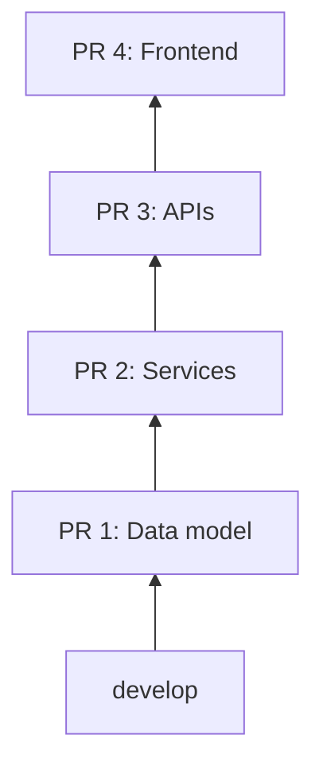

What slows large features is often not the code. It is review flow. One big PR, one long wait.

In this post, I will teach you how to use **stacked pull requests** so you can keep delivering while reviews are still in progress.

**>>>> [ Watch Video](https://www.youtube.com/watch?v=DXUhnqYhU4I) <<<<**

---

## TL;DR

**If you remember one thing: break one large PR into a sequence of small dependent PRs, then manage the stack with Graphite.**

1. **Split logically** For example by layer (data, services, APIs, frontend) or by vertical slice; this post uses a layer split as the example.
2. **Keep each PR independently reviewable** Each PR should be small enough to understand quickly.
3. **Use Graphite to restack automatically** Avoid manual rebasing across many branches.

**The practical flow:**

1. Create first PR from `develop` (or your main branch)
2. Create next PR on top of the previous PR
3. Repeat until the feature is complete
4. Update lower PRs as feedback arrives, then restack the branches

## The Problem

Most teams still do this:

1. Create one big feature branch
2. Push dozens of commits
3. Open one large PR
4. Wait

Then you are blocked. You cannot safely move to the next piece because the foundation is waiting for review.

Can this work? Yes. Is it fast for a team? Usually no.

Stacked PRs help when **review** is the real bottleneck. If the real issues are unclear scope, slow product decisions, or only merging when the whole feature is done, this workflow adds process but may not fix the root cause.

The review quality also drops. Large PRs are harder to reason about, and reviewers miss important details when too much changes at once.

## The Solution

A stacked PR workflow turns one large review into a chain of small reviews.

Each branch depends on the previous one:



Now each PR is focused and testable. Your team can review faster, and you can continue building the next layer while lower layers are in review. There is coordination overhead: reviewers must know which PR to review first, and upper PRs stay blocked until lower ones merge.

## How to Use It

Let me show you the workflow in a practical way.

### 1) Split the feature into logical layers

Example feature: share bookmarks with other users.

A **layer** split is one option; another is a **vertical slice** per PR (each PR a thin end-to-end slice). This example uses layers.

Possible split:

1. Data model changes
2. Service layer changes
3. API layer changes
4. Frontend integration

### 2) Build the stack manually with Git

Start from `develop` and create the first branch:

```bash
git checkout develop
git checkout -b feature/share-datamodel
```

Commit and push:

```bash
git add .
git commit -m "feat(share): add data model"
git push -u origin feature/share-datamodel
```

Open PR 1 to `develop`.

Then create branch 2 from branch 1, not from `develop`:

```bash
git checkout -b feature/share-services
git add .
git commit -m "feat(share): add services"
git push -u origin feature/share-services
```

Open PR 2 with base branch set to `feature/share-datamodel`.

Repeat for APIs and frontend.

### 3) Understand the manual cost

If PR 1 gets review feedback, you update PR 1 first. After that, you need to rebase PR 2, PR 3, and PR 4 in order and force-push each one.

That is where manual stacks become time-consuming.

Here is what that usually looks like:

1. Update PR 1, then push it
2. Rebase PR 2 onto the updated PR 1, resolve conflicts, then force-push
3. Rebase PR 3 onto the updated PR 2, resolve conflicts, then force-push
4. Repeat until the top of the stack is updated

Example rebases (conceptually):

```bash
# after updating feature/share-datamodel
git checkout feature/share-services
git rebase feature/share-datamodel
git push --force-with-lease origin feature/share-services

git checkout feature/share-apis
git rebase feature/share-services
git push --force-with-lease origin feature/share-apis

git checkout feature/share-frontend
git rebase feature/share-apis
git push --force-with-lease origin feature/share-frontend
```

It works, but the overhead adds up. This is why many teams try stacked PRs once, then give up.

## Using Graphite CLI

Graphite helps automate stacked branch management.

Install and configure once:

```bash
npm install -g @withgraphite/graphite-cli
gt auth
```

Create each layer as a new stacked commit and branch:

```bash
gt create -am "feat(share): add data model"
gt create -am "feat(share): add services"
gt create -am "feat(share): add APIs"
```

When you need to update an existing branch in the stack:

```bash
gt checkout <branch-name>
# make changes
gt modify
```

Graphite restacks the dependent branches for you.

Submit stack PRs and sync updates:

```bash
gt submit
gt sync
```

> **Important:** If you do not use Graphite's PR integration, you may need to force-push updated branches after restacking.

One note: CLIs evolve. If a command differs in your version, use `gt --help` and follow Graphite's docs for the current workflow.

## Manual vs Graphite

This is the same situation as above: you got feedback on the bottom PR, and you need to propagate that change through the stack.

| Task | Manual stack | With Graphite |
| --- | --- | --- |
| Update one layer | Edit, commit, push | `gt checkout` then `gt modify` |
| Propagate changes upward | Rebase each branch in order, push each one | `gt sync` restacks dependent branches |
| Keep PR bases correct | Update base branches in the UI as needed | Graphite PR integration can manage bases for you |

**My practical takeaway:** stacked PRs are a great idea. The manual workflow is real work. A tool like Graphite reduces that work enough that the workflow stays usable.

## How to Land the Stack

Stacked PRs save time, but only if you merge them in a predictable order.

Here is the rule: **merge from the bottom up.**

1. Get PR 1 approved and merged into `develop`
2. Restack or rebase the remaining branches onto the updated `develop`
3. Update the base of PR 2 (it should now target `develop`)
4. Repeat for PR 2, then PR 3, then PR 4

If you merge a middle PR first, you usually create extra conflict work and you make the review harder to follow. One wrong merge and you are in rebase/retargeting hell; following the rule (and using tooling) matters.

## Tradeoffs

**Pros**

- Smaller, faster reviews
- Better reviewer focus and feedback quality
- Less blocked time while waiting for review
- Cleaner history of how a feature was built (though some prefer one squash per feature; see Caveats)

**Cons**

- More branches and PRs to manage
- Mental overhead and coordination: which PR first, merge order, and blocked PRs
- Requires discipline in splitting changes logically
- Can confuse teams that are new to stacked workflows

## Best Practices

1. **Keep each PR independently reviewable** A reviewer should understand one PR without reading the whole stack first.
2. **Name branches clearly** Use names that show order and purpose.
3. **Start review from the bottom PR** Always review base layers first.
4. **Keep each PR small** Aim for one concern per PR.
5. **Keep each PR runnable** Use feature flags, scaffolding, or temporary adapters so CI stays meaningful at every layer.
6. **Treat stack updates as routine** Feedback on lower PRs is normal, plan for restacks.

## Caveats

Nothing here is set in stone. This workflow is one option; adapt or skip it if your context differs.

**Is review really the bottleneck?** If the real issues are unclear scope, slow product decisions, or "we only merge when the whole feature is done," stacked PRs add process but do not fix the root cause. Check the constraint before adopting.

**Layer split is one way to split.** A vertical slice per PR (thin end-to-end slice per PR) can also make sense. Choose what keeps each PR independently reviewable and runnable.

**Coordination and mental overhead.** Stacks introduce costs: reviewers context-switching across several PRs, "which PR do I review first?," "PR 2 is blocked until PR 1 merges," and the need for everyone to understand base branches and merge order.

**Merge from the bottom up.** One wrong merge and you are in rebase/retargeting hell. Discipline (and tooling like Graphite) matters.

**Other alternatives.** Smaller PRs and faster merges to main with feature flags can achieve similar benefits without stacks. Stacked PRs are one approach, not the only one.

**How stacks look in history.** Some prefer a single squash per feature (one merge = one feature). To them, a long chain of stacked merges is noisier history. "Cleaner" depends on whether you value many small merges or one feature per merge.

## Watch the Demo

Here is the full video walkthrough:

<div style="position: relative; padding-bottom: 56.25%; height: 0; overflow: hidden; max-width: 100%;">
  <iframe style="position: absolute; top: 0; left: 0; width: 100%; height: 100%;" src="https://www.youtube.com/embed/DXUhnqYhU4I" frameborder="0" allow="accelerometer; autoplay; clipboard-write; encrypted-media; gyroscope; picture-in-picture" allowfullscreen></iframe>
</div>

## Conclusion

Stacked PRs reduce review bottlenecks and keep delivery flow moving. Tooling like Graphite helps; the leverage is in the workflow. Other approaches (e.g. smaller PRs and faster merges to main with feature flags) can also reduce bottlenecks; stacked PRs are one option.

If your team struggles with large PRs and long review cycles, try this on one feature first. You will quickly see whether it improves your feedback speed and code quality.

If you made it this far, thank you for reading.  
Would you use stacked PRs on your team, or is this too much process for your current workflow?
